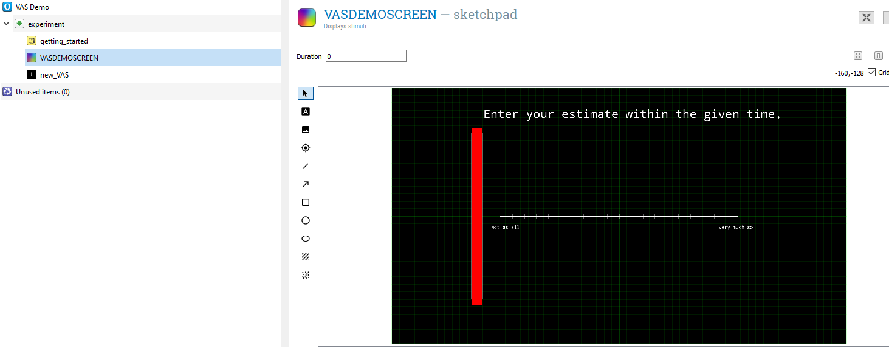

# EventExchanger

Github link:
[https://github.com/markspan/evtplugins](https://github.com/markspan/evtplugins)

## Short Description:

Python Wrapper to use hardware the University of Groningen in 0penSesame,
faculty of Behavioural and Social Sciences, department of Research Support developed.

Code Written by Eise Hoekstra and Mark M. Span, Maintained by Mark M. Span

## Usage:

Start Opensesame *as Administrator*.
Open the debug window of OpenSesame, and type:

```
 pip install evtplugins
```
and then, if this results in succes, close OpenSesame, and open it again, but now no need for administrators rights anymore.

If all went well, the plugins are now availeable in your toolbox.


*at the moment* there are four (4) plugins availeable. 

- EVTXX item: send codes throught an "EventExchanger" to a fysiology recording, to synchronise the behavioural data with the fysiological data.
- ResponseBox item: Alternative to the default 'JoyStick' plugin. Made for the custom made buttonboxes of Research Support.
- RGB_Led_Control item: Extended Responsebox iterm for use with the RGB Responsebox, enabeling color use and feedback on the buttonbox.
- VAS item: a "Visual Analogue Scale". I tried to make it as customizeable as possible, so its upto the user to stay close to the original VAS, or design theitr own.


## Usage of each item:

### EVTXX

### ResponseBox

### RGB-Led-Control

### VAS



## Thank you, come again!
```
